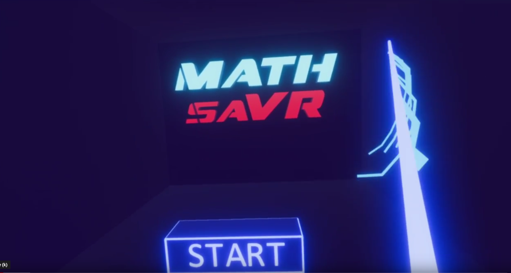
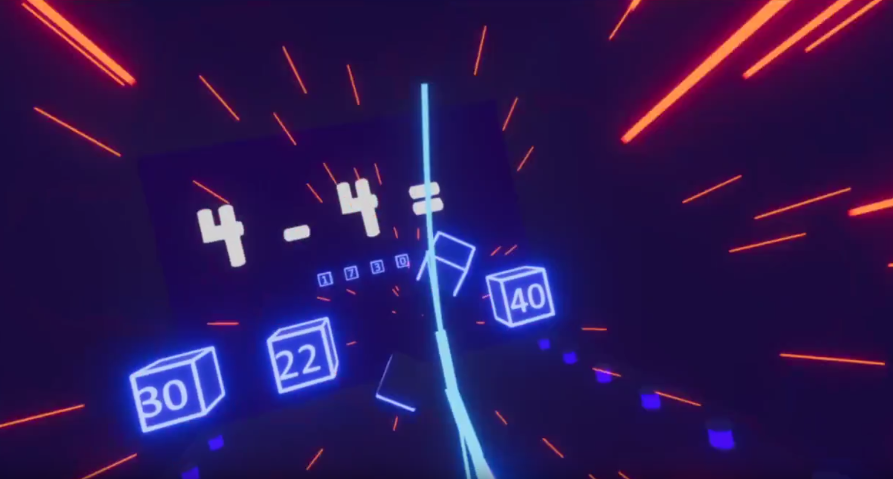
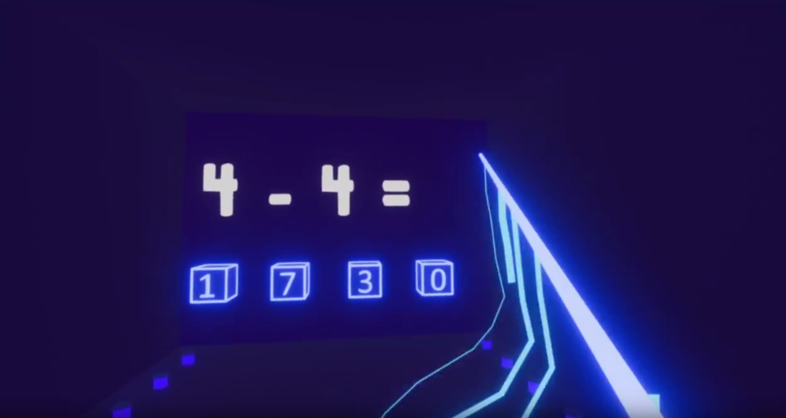
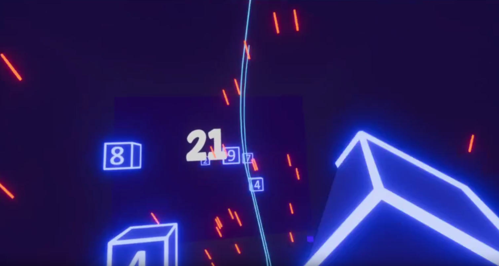

# MathSaVR

## Description
MathSaVR is a educational VR game based off Beat Saber that aims to make solving simple maths equations in a fun and interactive way. It also collects stats to help a teacher or someone else to gauge how good the player actually did in the game.

## Custom Questions
If you want custom questions to show up in game in the **Master** mode, after building out the game, Edit `Questions.txt` following the format in https://github.com/Rud156/MathSaber/blob/master/Custom%20Question%20Format/Question%20Format.pdf

## Build
https://github.com/Rud156/MathSaber/blob/master/Build/MathSavr.7z
### If you want to build to the game yourself:
- Build it normally as you would through Unity
- Copy the `EquationsQuestions` folder into the Build forlder
- Ensure that the `EquationsQuestions` folder has `Questions.txt` file
- Edit `Questions.txt` file based on the above linked PDF to add new questions

## Video
https://github.com/Rud156/MathSaber/blob/master/Video/MathSavrGamePlay.mp4

## ScreenShots

